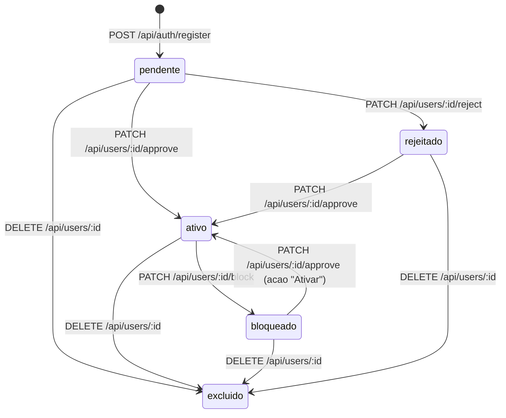

# Governanca de Usuarios

Atualizado em: 2026-02-19

## 1. Visao Geral do Modulo

O modulo **Gerenciar Usuarios** consolida governanca de ciclo de vida de contas, seguranca operacional e controle de acesso administrativo.

Fontes de verdade:

- Backend: `institutoback/routes/users.js`, `institutoback/routes/auth.js`, `institutoback/middleware/auth.js`
- Frontend: `src/components/admin/UserManagement.tsx`, `src/pages/TrocarSenhaObrigatoria.tsx`
- Banco: tabela `users` com colunas `status`, `first_access`, `must_change_password`, `deleted_at`

Escopo funcional principal:

- aprovar, rejeitar, bloquear e reativar usuarios;
- resetar senha administrativa;
- forcar troca obrigatoria de senha no proximo login;
- excluir usuario via soft delete;
- impor troca de senha obrigatoria no frontend quando `must_change_password = true`.

## 2. Modelo de Estados do Usuario

### 2.1 Estados e Semantica

| Estado | Coluna `status` | Pode autenticar? | Observacao |
|---|---|---|---|
| Pendente | `pendente` | Nao | Aguardando decisao administrativa |
| Ativo | `ativo` | Sim, com regras de senha | Estado operacional normal |
| Bloqueado | `bloqueado` | Nao | Conta bloqueada por governanca |
| Rejeitado | `rejeitado` | Nao | Conta recusada por governanca |
| Excluido (logico) | `deleted_at IS NOT NULL` | Nao | Registro preservado para auditoria |

Regras complementares de acesso:

- `first_access = true` bloqueia login normal e exige fluxo de primeiro acesso.
- `must_change_password = true` permite login tecnico, mas bloqueia navegacao ate troca obrigatoria.

### 2.2 Fluxograma de Status



### 2.3 Tabela de Transicao de Estados

| Origem | Acao | Endpoint | Destino | Permitida | Condicao |
|---|---|---|---|---|---|
| `pendente` | Aprovar | `PATCH /api/users/:id/approve` | `ativo` | Sim | Perfil administrativo autorizado |
| `pendente` | Rejeitar | `PATCH /api/users/:id/reject` | `rejeitado` | Sim | Perfil administrativo autorizado |
| `ativo` | Bloquear | `PATCH /api/users/:id/block` | `bloqueado` | Sim | Perfil administrativo autorizado |
| `bloqueado` | Ativar | `PATCH /api/users/:id/approve` | `ativo` | Sim | Perfil administrativo autorizado |
| `rejeitado` | Ativar | `PATCH /api/users/:id/approve` | `ativo` | Sim | Perfil administrativo autorizado |
| Qualquer nao excluido | Excluir | `DELETE /api/users/:id` | Excluido logico | Sim | Nao pode autoexclusao; regras extras para `admin` |
| Excluido logico | Qualquer acao acima | N/A | N/A | Nao | Rotas filtram `deleted_at IS NULL` |

Transicoes bloqueadas por regra:

| Regra bloqueada | Comportamento atual |
|---|---|
| Excluir o proprio usuario | `400` |
| Excluir usuario principal `admin` | `403` |
| Usuario nao-admin operar conta com role `admin` em acoes criticas | `403` |

## 3. Documentacao Funcional dos Botoes da Interface

### 3.1 Botao: Aprovar

| Item | Descricao |
|---|---|
| Objetivo funcional | Liberar usuario para acesso do sistema |
| Endpoint | `/api/users/:id/approve` |
| Metodo HTTP | `PATCH` |
| Query executada | `UPDATE users SET status = 'ativo' WHERE id = $2 AND deleted_at IS NULL RETURNING username, name` |
| Alteracao de colunas | `status -> ativo`; `first_access` sem alteracao; `must_change_password` sem alteracao; `deleted_at` sem alteracao |
| Regra de permissao | Exige JWT e `adminMiddleware` (papeis/escopos administrativos) |
| Impacto no login | Se `status='ativo'`, usuario deixa de ser bloqueado pela regra de status no login |
| Reversivel | Sim, via `Bloquear` ou `Rejeitar` |
| Riscos/observacoes | Acao direta de status; nao registra historico de aprovador na tabela `users` |

### 3.2 Botao: Rejeitar

| Item | Descricao |
|---|---|
| Objetivo funcional | Recusar conta em analise |
| Endpoint | `/api/users/:id/reject` |
| Metodo HTTP | `PATCH` |
| Query executada | `UPDATE users SET status = 'rejeitado' WHERE id = $2 AND deleted_at IS NULL RETURNING username, name` |
| Alteracao de colunas | `status -> rejeitado`; demais colunas sem alteracao |
| Regra de permissao | Exige JWT e `adminMiddleware` |
| Impacto no login | Login negado por regra `status !== 'ativo'` |
| Reversivel | Sim, via `Aprovar/Ativar` |
| Riscos/observacoes | Sem trilha nativa de motivo de rejeicao |

### 3.3 Botao: Bloquear

| Item | Descricao |
|---|---|
| Objetivo funcional | Suspender acesso de conta ja aprovada |
| Endpoint | `/api/users/:id/block` |
| Metodo HTTP | `PATCH` |
| Query executada | `UPDATE users SET status = 'bloqueado' WHERE id = $2 AND deleted_at IS NULL RETURNING username, name` |
| Alteracao de colunas | `status -> bloqueado`; demais colunas sem alteracao |
| Regra de permissao | Exige JWT e `adminMiddleware` |
| Impacto no login | Login negado por regra de status |
| Reversivel | Sim, via botao `Ativar` |
| Riscos/observacoes | Bloqueio nao invalida token ja emitido de forma ativa no backend; aplicacao depende da verificacao de sessao no frontend |

### 3.4 Botao: Ativar

| Item | Descricao |
|---|---|
| Objetivo funcional | Reativar usuario bloqueado ou rejeitado |
| Endpoint | `/api/users/:id/approve` |
| Metodo HTTP | `PATCH` |
| Query executada | Mesma query de `Aprovar` (`status='ativo'`) |
| Alteracao de colunas | `status -> ativo`; demais colunas sem alteracao |
| Regra de permissao | Exige JWT e `adminMiddleware` |
| Impacto no login | Conta volta a atender requisito de status |
| Reversivel | Sim, via `Bloquear` ou `Rejeitar` |
| Riscos/observacoes | A mesma rota de aprovacao atende dois casos de negocio (aprovar e reativar) |

### 3.5 Botao: Resetar senha

| Item | Descricao |
|---|---|
| Objetivo funcional | Definir senha temporaria administrativa para usuario alvo |
| Endpoint | `/api/users/:id/reset-password` |
| Metodo HTTP | `POST` |
| Query executada | `SELECT id, role FROM users WHERE id = $1 AND deleted_at IS NULL` + `UPDATE users SET password = $1, first_access = true, must_change_password = false WHERE id = $2 AND deleted_at IS NULL` |
| Alteracao de colunas | `password` (hash bcrypt), `first_access -> true`, `must_change_password -> false`, `status` sem alteracao, `deleted_at` sem alteracao |
| Regra de permissao | Exige JWT e `adminMiddleware`; somente role `admin` pode resetar senha de conta com role `admin` |
| Impacto no login | Login retorna bloqueio de primeiro acesso ate usuario definir nova senha no fluxo apropriado |
| Reversivel | Parcialmente; usuario final conclui fluxo e restaura `first_access=false` |
| Riscos/observacoes | Senha trafega no body (requer HTTPS em producao); exige politica operacional para distribuicao segura da senha temporaria |

### 3.6 Botao: Forcar redefinicao de senha

| Item | Descricao |
|---|---|
| Objetivo funcional | Exigir troca de senha no proximo login sem reset administrativo de senha |
| Endpoint | `/api/users/:id/force-password-change` |
| Metodo HTTP | `PATCH` |
| Query executada | `SELECT id, role, username, name FROM users WHERE id = $1 AND deleted_at IS NULL` + `UPDATE users SET must_change_password = true, first_access = false WHERE id = $1 AND deleted_at IS NULL` |
| Alteracao de colunas | `must_change_password -> true`, `first_access -> false`; `status` sem alteracao; `deleted_at` sem alteracao |
| Regra de permissao | Exige JWT e `adminMiddleware`; conta alvo `admin` so pode ser operada por role `admin` |
| Impacto no login | Login autentica e retorna flag; frontend obriga rota de troca de senha antes de acesso ao sistema |
| Reversivel | Sim; usuario conclui `PUT /api/auth/change-password` e backend define `must_change_password=false` |
| Riscos/observacoes | Processo depende de enforcement no frontend; manter integracao de guards obrigatoria |

### 3.7 Botao: Excluir usuario

| Item | Descricao |
|---|---|
| Objetivo funcional | Remover usuario do dominio operacional sem apagar historico fisico |
| Endpoint | `/api/users/:id` |
| Metodo HTTP | `DELETE` |
| Query executada | `SELECT id, name, email, username, role FROM users WHERE id = $1 AND deleted_at IS NULL` + `UPDATE users SET deleted_at = NOW() WHERE id = $1 AND deleted_at IS NULL` |
| Alteracao de colunas | `deleted_at -> NOW()`; `status`, `first_access`, `must_change_password` sem alteracao |
| Regra de permissao | Exige JWT e `adminMiddleware`; bloqueia autoexclusao; bloqueia exclusao do `admin` principal; conta `admin` exige requisitante role `admin` |
| Impacto no login | Conta deixa de autenticar (consultas de login filtram `deleted_at IS NULL`) |
| Reversivel | Nao, no estado atual (nao existe endpoint de restauracao) |
| Riscos/observacoes | Dado pessoal permanece em base (conformidade LGPD deve definir prazo/criterio de retencao e anonimizacao) |

## 4. Endpoints de Governanca (Contrato API)

### 4.1 `PATCH /api/users/:id/approve`

Request:

- Header: `Authorization: Bearer <token>`
- Params: `id` (obrigatorio)
- Body: vazio

Response `200` (exemplo):

```json
{
  "message": "Usuario Fulano aprovado com sucesso!",
  "user": {
    "username": "fulano",
    "name": "Fulano da Silva"
  }
}
```

Status codes:

- `200`: sucesso
- `401`: token ausente/invalido
- `403`: sem permissao administrativa
- `404`: usuario nao encontrado ou excluido logicamente
- `500`: erro interno

### 4.2 `PATCH /api/users/:id/reject`

Request:

- Header: `Authorization: Bearer <token>`
- Params: `id`
- Body: vazio

Response `200` (exemplo):

```json
{
  "message": "Usuario Fulano rejeitado.",
  "user": {
    "username": "fulano",
    "name": "Fulano da Silva"
  }
}
```

Status codes: `200`, `401`, `403`, `404`, `500`.

### 4.3 `PATCH /api/users/:id/block`

Request:

- Header: `Authorization: Bearer <token>`
- Params: `id`
- Body: vazio

Response `200` (exemplo):

```json
{
  "message": "Usuario Fulano bloqueado.",
  "user": {
    "username": "fulano",
    "name": "Fulano da Silva"
  }
}
```

Status codes: `200`, `401`, `403`, `404`, `500`.

### 4.4 `PATCH /api/users/:id/force-password-change`

Request:

- Header: `Authorization: Bearer <token>`
- Params: `id`
- Body: vazio

Response `200`:

```json
{
  "message": "Usuario Fulano precisara redefinir a senha no proximo login."
}
```

Status codes:

- `200`: sucesso
- `401`: token ausente/invalido
- `403`: sem permissao ou tentativa de nao-admin operar conta admin
- `404`: usuario nao encontrado
- `500`: erro interno

### 4.5 `DELETE /api/users/:id`

Request:

- Header: `Authorization: Bearer <token>`
- Params: `id`
- Body: vazio

Response `200`:

```json
{
  "message": "Usuario Fulano excluido com sucesso.",
  "user": {
    "id": 123,
    "name": "Fulano",
    "email": "fulano@dominio.com"
  }
}
```

Status codes:

- `200`: sucesso
- `400`: tentativa de autoexclusao
- `401`: token ausente/invalido
- `403`: regra especial de protecao (admin principal/admin role)
- `404`: usuario nao encontrado
- `500`: erro interno

### 4.6 `PUT /api/auth/change-password`

Request:

- Header: `Authorization: Bearer <token>`
- Body:

```json
{
  "currentPassword": "senhaAtual",
  "newPassword": "novaSenhaComMinimo8"
}
```

Response `200`:

```json
{
  "success": true,
  "message": "Senha alterada com sucesso."
}
```

Status codes:

- `200`: sucesso
- `400`: payload invalido, senha atual incorreta, senha nova igual a atual
- `401`: token ausente/invalido
- `404`: usuario nao encontrado
- `500`: erro interno

Erros possiveis (mensagens atuais):

- `Dados invalidos`
- `Senha atual invalida`
- `A nova senha deve ser diferente da senha atual`
- `Usuario nao encontrado`
- `Erro interno do servidor`

## 5. Politica de Seguranca de Senha

### 5.1 Regras tecnicas atuais

- Hash de senha: `bcryptjs`.
- `PUT /api/auth/change-password`: senha nova com minimo de 8 caracteres.
- `POST /api/users/:id/reset-password`: minimo atual de 6 caracteres (regra legada).
- `PATCH /api/users/:id/force-password-change`: nao troca senha; apenas obriga troca no proximo login.

### 5.2 Impacto no fluxo de autenticacao

1. Login valida `status='ativo'`, senha correta e `deleted_at IS NULL`.
2. Se `first_access=true`, acesso normal e bloqueado e o sistema exige setup de senha.
3. Se `must_change_password=true`, login retorna sucesso tecnico, mas o frontend redireciona para troca obrigatoria.

## 6. Regras de Autorizacao

### 6.1 Rotas administrativas de usuarios

As rotas abaixo exigem `adminMiddleware`:

- `GET /api/users`
- `GET /api/users/pending`
- `PATCH /api/users/:id/approve`
- `PATCH /api/users/:id/reject`
- `PATCH /api/users/:id/block`
- `PATCH /api/users/:id/force-password-change`
- `DELETE /api/users/:id`
- `POST /api/users/:id/reset-password`

### 6.2 Criterio de privilegio no middleware

Autorizacao permitida quando houver:

- role em: `coordenador geral`, `administrador`, `admin`, `gestao`, `gestor`; ou
- permissao em: `admin:all`, `admin`, `manage:users`, `users:manage`.

### 6.3 Regras condicionais adicionais

- Operacoes sensiveis contra conta com role `admin` exigem requisitante role `admin`:
  - `PATCH /api/users/:id/force-password-change`
  - `POST /api/users/:id/reset-password`
  - `DELETE /api/users/:id`
- `DELETE /api/users/:id` bloqueia autoexclusao e exclusao da conta principal `admin`.

## 7. Consideracoes de Auditoria

### 7.1 Controles existentes

- Soft delete preserva linha em `users`.
- Filtragem por `deleted_at IS NULL` evita reuso operacional da conta excluida.
- Mensagens de erro tratadas por endpoint e status HTTP.

### 7.2 Lacunas atuais

- Ausencia de trilha de auditoria dedicada para "quem fez o que" (actor, timestamp, motivo).
- Ausencia de endpoint de restauracao controlada de usuario excluido.
- Ausencia de motivo estruturado para rejeicao/bloqueio.

### 7.3 Recomendacoes de evolucao

- Criar tabela de auditoria (`user_governance_audit`) com ator, acao, alvo, motivo e snapshot.
- Registrar motivo obrigatorio em acoes `reject`, `block` e `delete`.
- Padronizar politica minima de senha (8+) tambem para reset administrativo.

## 8. Validacao de Aderencia ao Codigo

Checklist executado para esta documentacao:

- Endpoints documentados existem em `institutoback/routes/users.js` e `institutoback/routes/auth.js`.
- Flags `first_access`, `must_change_password` e `deleted_at` estao refletidas conforme queries atuais.
- Regras de permissao e restricoes especiais foram extraidas de `adminMiddleware` e validacoes por endpoint.
- Fluxo de login foi validado em `POST /api/auth/login` e resposta de `GET /api/auth/verify`.
